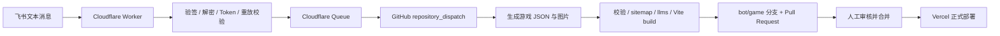

# 飞书小游戏自动入库与安全部署

本文从“企业自建飞书应用已经创建”开始，目标流程是：



生产站点和 Vercel 不持有仓库写权限。飞书入口也不直接推送 `main`，只生成 PR。

## 一、先把本次基础架构发布到 main

`repository_dispatch` 只能触发默认分支上已经存在的 workflow。因此，必须先用正常流程把本次代码合并到 `main`，确认以下文件在 GitHub 默认分支可见：

- `.github/workflows/ingest-game.yml`
- `scripts/ingest-game.mjs`
- `src/content/games/*.json`
- `automation/feishu-worker/`

本地先运行：

```powershell
npm ci
npm run test:automation
npm run build
```

## 二、配置 GitHub

### 1. 允许 GitHub Actions 创建 PR

进入仓库：

`Settings > Actions > General > Workflow permissions`

选择 `Read and write permissions`，并启用 `Allow GitHub Actions to create and approve pull requests`。工作流本身只声明：

- `contents: write`：创建并推送 `bot/game/...` 分支。
- `pull-requests: write`：创建 PR。

### 2. 创建给 Worker 使用的 fine-grained PAT

在 GitHub 个人设置创建 Fine-grained personal access token：

1. Repository access 只选择 `kanmiian/crazy-cattle`。
2. Repository permissions 将 `Contents` 设置为 `Read and write`，用于调用 repository dispatch。
3. 设置明确的过期时间，建议 30 到 90 天，并建立轮换提醒。
4. 不要赋予 Organization 管理、用户资料、删除仓库等权限。

这个 PAT 只放入 Cloudflare Worker Secret `GITHUB_TOKEN`，不要放入前端、Vercel 环境变量或仓库文件。GitHub Action 创建 PR 时使用的是单次运行的 `GITHUB_TOKEN`，不是这个 PAT。

### 3. 可选：让 Action 把 PR 地址回复到飞书

进入：

`Repository > Settings > Secrets and variables > Actions > New repository secret`

添加：

- `FEISHU_APP_ID`
- `FEISHU_APP_SECRET`

如果不配置这两个 Secret，内容入库和 PR 创建仍然正常，只是不发送飞书结果消息。

## 三、配置飞书应用

### 1. 记录应用凭证

进入飞书开放平台应用详情：

`凭证与基础信息 > 应用凭证`

记录：

- App ID：仅用于 GitHub Action 的可选结果通知。
- App Secret：属于高敏感密钥，只放 GitHub Actions Secret。

### 2. 启用机器人能力

在应用能力中添加“机器人”。设置机器人名称和头像后保存。

### 3. 只申请必要权限

进入 `权限管理`。按实际接收方式选择，不要默认申请“群内所有消息”：

| 使用方式 | 推荐权限 | 说明 |
| --- | --- | --- |
| 用户私聊机器人提交 | `im:message.p2p_msg:readonly` | 权限最小，最推荐。 |
| 群内 @ 机器人提交 | `im:message.group_at_msg:readonly` | 只收到 @ 机器人的用户消息。 |
| 群内不 @ 机器人也要识别 | `im:message.group_msg` | 敏感权限，只有确有需要时申请。 |
| 机器人回复处理结果 | `im:message:send_as_bot` | 配置 GitHub 中的 App ID/Secret 后需要。 |

本流程不需要通讯录、用户手机号、文档、群管理等权限。

### 4. 生成并配置 Encrypt Key

进入：

`开发配置 > 事件与回调 > 加密策略`

飞书自动生成 Verification Token。复制它，稍后写入 Worker Secret。不要把 Verification Token 当作唯一保护，它在无加密模式下会明文传输。

Encrypt Key 建议生成 32 字节随机值。PowerShell 命令：

```powershell
$keyBytes = [byte[]]::new(32)
[System.Security.Cryptography.RandomNumberGenerator]::Fill($keyBytes)
[Convert]::ToBase64String($keyBytes)
```

把输出保存到密码管理器，然后填入飞书的 Encrypt Key。不要使用应用名、域名、日期、App Secret 或可记忆口令。

为什么生产环境必须配置 Encrypt Key：

- 飞书用它对事件正文执行 AES-256-CBC 加密。
- Worker 用它在解密前校验 `X-Lark-Signature`，可拒绝伪造请求。
- Verification Token 被包含在加密正文中，不再明文暴露。

飞书协议固定如下，不能自行改为别的 AES 模式或 HMAC：

```text
signature = hex(SHA256(timestamp + nonce + EncryptKey + raw_request_body))
aes_key   = SHA256(EncryptKey)       # 32 个原始字节
body      = base64(iv + ciphertext)  # iv 为前 16 字节
cipher    = AES-256-CBC + PKCS7Padding
```

验签必须使用收到的原始 body。不能先 `JSON.parse` 再 `JSON.stringify`，空格或字段顺序变化都会使签名失效。

## 四、部署独立 Cloudflare Worker

不要把这段逻辑加入现有的 R2 静态资源 Worker。入库 Worker 持有 GitHub PAT，必须与静态资源服务分开部署、分开授权。

### 1. 登录并创建存储资源

```powershell
Set-Location D:\git\crazy-cattle
npx wrangler@4 login
npx wrangler@4 kv namespace create FEISHU_EVENTS
npx wrangler@4 queues create crazy-cattle-game-ingest
npx wrangler@4 queues create crazy-cattle-game-ingest-dlq
```

KV 创建命令会返回 namespace ID。把 [wrangler.toml](../automation/feishu-worker/wrangler.toml) 中的：

```toml
id = "REPLACE_WITH_KV_NAMESPACE_ID"
```

替换为真实 ID。KV 保存 24 小时 `message_id`，用于阻止重复提交；Queue 在 GitHub 暂时不可用时自动重试 5 次，之后进入 DLQ。

### 2. 用交互式命令写入 Secret

以下命令会提示输入值。不要把真实值直接写在命令行参数里：

```powershell
Set-Location D:\git\crazy-cattle\automation\feishu-worker
npx wrangler@4 secret put FEISHU_VERIFICATION_TOKEN
npx wrangler@4 secret put FEISHU_ENCRYPT_KEY
npx wrangler@4 secret put GITHUB_TOKEN
```

分别输入：

- 飞书加密策略页中的 Verification Token。
- 上一步填入飞书的 Encrypt Key，必须逐字一致。
- GitHub fine-grained PAT。

`GITHUB_OWNER`、`GITHUB_REPO`、`REQUIRE_ENCRYPTION=true` 等非敏感值已经在 `wrangler.toml` 中配置。

### 3. 部署并检查

```powershell
npx wrangler@4 deploy
Invoke-RestMethod https://crazy-cattle-feishu-ingest.<你的-workers-subdomain>.workers.dev/health
```

健康检查应返回：

```json
{"ok":true}
```

事件回调地址是：

```text
https://crazy-cattle-feishu-ingest.<你的-workers-subdomain>.workers.dev/feishu/events
```

`/health` 不读取或返回任何 Secret。`/feishu/events` 只接受 POST，正文上限 128 KiB。

## 五、配置飞书事件回调

### 1. 保存回调 URL

进入：

`开发配置 > 事件与回调 > 事件配置`

选择“将事件发送至开发者服务器”，填入 Worker 的 `/feishu/events` 地址并保存。

飞书会发送 `url_verification` 请求。Worker 会：

1. 解密已配置 Encrypt Key 的请求。
2. 对比 Verification Token。
3. 在 1 秒要求内原样返回 `{ "challenge": "..." }`。

如果保存时报 `Challenge code 没有返回`，先执行：

```powershell
npx wrangler@4 tail
```

常见原因是 Worker 中的 Encrypt Key 或 Verification Token 与飞书不一致、回调 URL 路径遗漏 `/feishu/events`，或 `wrangler.toml` 的 KV ID 未替换。

### 2. 添加消息事件

在事件配置中添加：

```text
im.message.receive_v1
```

飞书官方说明：消息事件特殊情况下可能重复推送，必须使用 `message_id` 去重，不要只使用 `event_id`。本 Worker 已按此规则实现。

### 3. 创建版本并发布

权限和事件配置通常要在应用版本发布并经管理员批准后才对使用者生效：

1. 进入 `版本管理与发布`。
2. 创建版本，确认申请的消息权限。
3. 发布并完成企业管理员审核。
4. 把机器人添加到目标群，或直接私聊机器人。

如果只申请了群内 @ 权限，提交时必须 @ 机器人。

## 六、发送真实入库消息

支持一次提交 1 到 10 个项目，支持换行和全角竖线两种格式：

```text
网页/小游戏：
1. 关键词：⚠️ Game Name
描述：玩法、榜单信号、更新时间和推荐原因
项目链接：https://www.crazygames.com/game/game-name
Google Trends：Game Name vs GPTs
2. 关键词：Another Game｜描述：Newgrounds 前台推荐｜项目链接：https://www.newgrounds.com/portal/view/1234567｜Google Trends：Another Game vs GPTs
```

只接受以下来源和路径：

- `https://www.crazygames.com/game/...`
- `https://www.newgrounds.com/portal/view/...`

处理完成后：

1. Worker 将清洗后的字段写入 Queue，不保存整条飞书原始事件。
2. Queue 调用 GitHub `repository_dispatch`。
3. Action 检查现有 slug、key 和 source URL，重复项目不会再次添加。
4. Action 生成 `src/content/games/<slug>.json`。
5. 只从限定的 CrazyGames/Newgrounds 图片 CDN 下载 OG 图片；失败时使用站点已有兜底图。
6. 自动生成 sitemap、llms 文件并执行完整 build。
7. 推送 `bot/game/<slug>-<hash>` 分支并创建带审核清单的 PR。
8. 配置了飞书 App ID/Secret 时，机器人把 PR 地址回复到原 chat。

自动生成页会标记 `automation.reviewRequired: true`，并默认使用官方外链，不自动嵌入第三方 iframe。合并前必须核对玩法事实、描述质量、关键词和图片。

## 七、必须保留的保护

| 风险 | 已实现的保护 | 不应改成什么 |
| --- | --- | --- |
| 伪造飞书请求 | 原始 body 的 SHA-256 签名校验，常量时间比较 | 只判断 User-Agent、Referer 或 URL 隐蔽性 |
| 明文事件泄露 | Encrypt Key + AES-256-CBC；全程 HTTPS | 关闭 Encrypt Key，只检查 Token |
| 错应用或错环境事件 | 解密后再次校验 Verification Token | 只验签、不核对 Token |
| 截获后重放 | 请求时间戳允许偏差 300 秒；KV 按 `message_id` 保存 24 小时 | 只按 `event_id` 去重 |
| GitHub 短暂故障 | Queue 重试 5 次并转入 DLQ | 在飞书回调中执行完整构建 |
| SSRF 和恶意外链 | HTTPS、精确 host/path 白名单、重定向逐跳检查、大小限制 | 接受任意用户 URL 或任意图片 host |
| 重复页面 | Worker 去重 + Action 再按 slug/key/source URL 检查 | 只依赖消息格式或标题大小写 |
| 自动内容误发布 | bot 分支、完整 build、PR 审核门禁 | Worker 直接 push `main` |
| Secret 泄露 | Cloudflare Secret / GitHub Secret；不使用 `VITE_*` | 写入 `.env` 后提交或放前端环境变量 |
| Action 供应链漂移 | checkout/setup-node 锁定到已核验 commit SHA | 使用未知第三方 Action 或未锁定分支 |

建议在 Cloudflare Dashboard 额外打开 Worker 日志告警，并在观察正常流量后为 `/feishu/events` 设置宽松的 rate limit。不要把 IP 白名单作为唯一验证手段；飞书出口 IP 可能调整，签名才是主认证机制。

## 八、密钥轮换

Worker 支持当前值和上一值的短期双钥窗口：

- `FEISHU_ENCRYPT_KEY` / `FEISHU_ENCRYPT_KEY_PREVIOUS`
- `FEISHU_VERIFICATION_TOKEN` / `FEISHU_VERIFICATION_TOKEN_PREVIOUS`

Encrypt Key 无停机轮换顺序：

1. 生成新 Encrypt Key。
2. 把旧 Key 写入 `FEISHU_ENCRYPT_KEY_PREVIOUS`。
3. 把新 Key 写入 `FEISHU_ENCRYPT_KEY` 并部署。
4. 在飞书加密策略页把 Encrypt Key 改成新值。
5. 发送测试消息并确认 PR 创建。
6. 删除上一把 Key：

```powershell
npx wrangler@4 secret delete FEISHU_ENCRYPT_KEY_PREVIOUS
```

Verification Token 的轮换顺序相同。GitHub PAT 轮换时先创建新 PAT并执行 `wrangler secret put GITHUB_TOKEN`，验证一次后再撤销旧 PAT。

如怀疑泄露，应立即撤销对应 PAT、重置飞书 App Secret/Encrypt Key/Verification Token，检查 Cloudflare Queue/DLQ、GitHub Actions 与 PR 历史，不要只修改回调 URL。

## 九、日常检查

```powershell
# 本地内容和安全测试
npm run test:automation
npm run content:validate
npm run build

# Worker 实时日志
Set-Location D:\git\crazy-cattle\automation\feishu-worker
npx wrangler@4 tail
```

还应检查：

- GitHub `Actions > Ingest game from Feishu` 是否成功。
- PR 中是否只有新游戏 JSON、受信任图片以及生成的索引文件。
- Cloudflare Queue 是否出现重试或 DLQ 消息。
- Vercel PR Preview 中的标题、正文、图片、移动端布局和外链是否正确。

## 官方参考

- [将事件发送至开发者服务器](https://open.feishu.cn/document/event-subscription-guide/event-subscriptions/event-subscription-configure-/choose-a-subscription-mode/send-notifications-to-developers-server)
- [步骤三：接收事件（签名与解密）](https://open.feishu.cn/document/server-docs/event-subscription-guide/event-subscription-configure-/encrypt-key-encryption-configuration-case)
- [接收消息 im.message.receive_v1](https://open.feishu.cn/document/uAjLw4CM/ukTMukTMukTM/reference/im-v1/message/events/receive)
