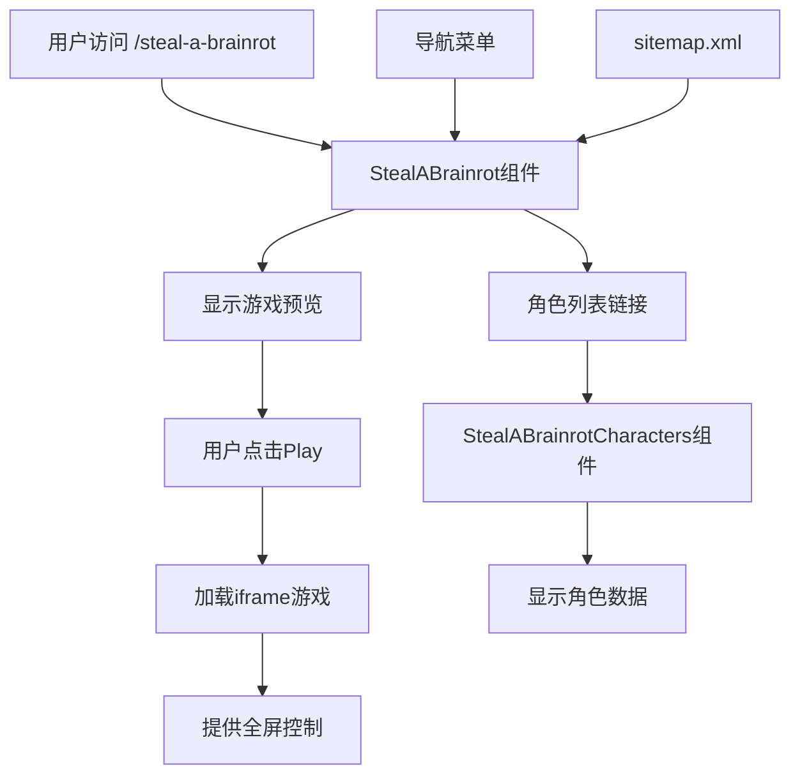

# 技术方案设计

## 架构概述
基于现有的React + Vite架构，新增Steal A Brainrot游戏页面，采用组件化设计，复用现有游戏页面的样式和交互模式。

## 技术栈
- **前端框架**: React 18 + Vite
- **路由**: React Router v6
- **样式**: CSS3 (复用现有样式)
- **状态管理**: React Hooks (useState, useRef)
- **SEO**: 自定义SEO组件

## 技术选型

### 1. 组件设计
- **StealABrainrot.jsx**: 主游戏页面组件
- **StealABrainrotCharacters.jsx**: 角色列表组件（弹窗或独立页面）
- 复用现有的游戏页面样式和交互逻辑

### 2. 数据获取
- 角色数据：基于外部Wiki页面内容，创建静态数据文件
- 游戏iframe：直接嵌入 https://playhop.com/dist-app/447574

### 3. 路由设计
```javascript
// 新增路由
<Route path="/steal-a-brainrot" element={<StealABrainrot />} />
<Route path="/steal-a-brainrot/characters" element={<StealABrainrotCharacters />} />
```

## 数据库/接口设计
无需数据库，使用静态数据：

### 角色数据结构
```javascript
const charactersData = {
  common: [
    {
      name: "Noobini Pizzanini",
      rarity: "Common",
      description: "基础角色，提供稳定收入",
      image: "/images/characters/noobini-pizzanini.webp"
    }
    // ... 更多角色
  ],
  rare: [...],
  epic: [...],
  legendary: [...],
  mythic: [...],
  brainrotGod: [...],
  secret: [...],
  og: [...]
}
```

## 测试策略
1. **功能测试**: 验证游戏加载、全屏功能、角色列表显示
2. **响应式测试**: 确保在不同设备上的显示效果
3. **SEO测试**: 验证meta标签、关键词密度
4. **性能测试**: 确保iframe加载不影响页面性能

## 安全性
1. **iframe安全**: 使用sandbox属性限制iframe权限
2. **外部链接**: 所有外部链接添加rel="noopener noreferrer"
3. **内容安全**: 验证外部数据源的安全性

## 部署策略
1. 静态文件部署到现有Vercel环境
2. 更新sitemap.xml自动提交搜索引擎
3. 确保CDN缓存策略正确

## 架构图


## 性能优化
1. **懒加载**: 使用React.lazy加载角色列表组件
2. **图片优化**: 使用WebP格式，添加loading="lazy"
3. **缓存策略**: 静态资源使用长期缓存
4. **代码分割**: 按路由分割代码包

## 兼容性
- **浏览器**: 支持现代浏览器（Chrome 90+, Firefox 88+, Safari 14+）
- **设备**: 响应式设计，支持桌面和移动设备
- **网络**: 优化低网速环境下的加载体验